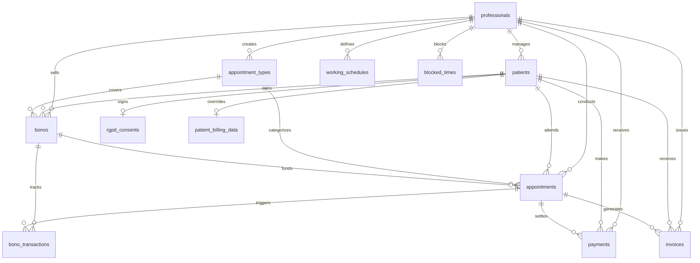

# Extended Data Model

> Complete database schema for the physiotherapy clinic management app.
> Source of truth for all entities, fields, relationships, constraints, enums, and business rules.
> Derived from PRD.md and DATA_MODEL.md.

---

## Enums & Allowed Values

```
ContactMethod        = "email" | "sms" | "whatsapp"
AppointmentStatus    = "scheduled" | "completed" | "cancelled" | "no_show"
PaymentMethod        = "card" | "bizum" | "cash"
PaymentStatus        = "pending" | "paid"
BonoStatus           = "active" | "exhausted"
BonoTransactionType  = "deduction" | "refund" | "manual_deduction"
DayOfWeek            = 0 (Monday) .. 6 (Sunday)
UserRole             = "professional" | "patient"
```

---

## Tables

### 1. `professionals`

Clinic professionals who manage patients and appointments.

| Column             | Type         | Constraints                        | Description                                    |
| ------------------ | ------------ | ---------------------------------- | ---------------------------------------------- |
| `id`               | UUID         | PK, auto-generated                 | Unique identifier                              |
| `auth_user_id`     | TEXT         | UNIQUE, NOT NULL                   | FK to `users.id` (auth table)                  |
| `first_name`       | TEXT         | NOT NULL                           | First name                                     |
| `last_name`        | TEXT         | NOT NULL                           | Last name                                      |
| `email`            | TEXT         | UNIQUE, NOT NULL                   | Login / contact email                          |
| `phone`            | TEXT         |                                    | Phone number                                   |
| `business_name`    | TEXT         |                                    | Business name for invoices                     |
| `tax_id`           | TEXT         |                                    | NIF/CIF for invoices                           |
| `address_street`   | TEXT         |                                    | Street address for invoices                    |
| `address_postal`   | TEXT         |                                    | Postal code                                    |
| `address_city`     | TEXT         |                                    | City                                           |
| `address_province` | TEXT         |                                    | Province                                       |
| `address_country`  | TEXT         | DEFAULT 'España'                   | Country                                        |
| `google_calendar_id` | TEXT       |                                    | Google Calendar ID for sync                    |
| `created_at`       | TIMESTAMPTZ  | DEFAULT now()                      |                                                |
| `updated_at`       | TIMESTAMPTZ  | DEFAULT now()                      |                                                |

**Access control:** Enforced via Hono auth middleware — a professional can only read/write their own row.

---

### 2. `patients`

Patients registered in the system. A patient belongs to one professional.

| Column               | Type         | Constraints                        | Description                                       |
| -------------------- | ------------ | ---------------------------------- | ------------------------------------------------- |
| `id`                 | UUID         | PK, auto-generated                 | Unique identifier                                 |
| `auth_user_id`       | TEXT         | UNIQUE                             | FK to `users.id` (nullable if created by professional) |
| `professional_id`    | UUID         | FK → professionals.id, NOT NULL    | Assigned professional                             |
| `first_name`         | TEXT         | NOT NULL                           | Nombre                                            |
| `last_name`          | TEXT         | NOT NULL                           | Apellidos                                         |
| `nie`                | TEXT         |                                    | NIE / DNI / passport                              |
| `phone`              | TEXT         | NOT NULL                           | Móvil                                             |
| `email`              | TEXT         |                                    | Email address                                     |
| `date_of_birth`      | DATE         |                                    | Fecha de nacimiento                               |
| `address_street`     | TEXT         |                                    | Calle                                             |
| `address_postal`     | TEXT         |                                    | Código postal                                     |
| `address_city`       | TEXT         |                                    | Localidad                                         |
| `address_province`   | TEXT         |                                    | Provincia                                         |
| `address_country`    | TEXT         | DEFAULT 'España'                   | País                                              |
| `contact_method`     | TEXT         | NOT NULL, DEFAULT 'whatsapp'       | Preferred contact method. Enum: `ContactMethod`   |
| `clinical_notes`     | TEXT         |                                    | Free-text clinical history / notes                |
| `created_at`         | TIMESTAMPTZ  | DEFAULT now()                      |                                                   |
| `updated_at`         | TIMESTAMPTZ  | DEFAULT now()                      |                                                   |

**Access control:** Enforced via Hono auth middleware — a professional can only access patients where `professional_id` = their own ID.

---

### 3. `patient_billing_data`

Optional override of patient personal data for invoices. If a row exists, use these values on invoices instead of the patient's personal data. Patients can modify this before downloading an invoice.

| Column             | Type         | Constraints                        | Description                        |
| ------------------ | ------------ | ---------------------------------- | ---------------------------------- |
| `id`               | UUID         | PK, auto-generated                 | Unique identifier                  |
| `patient_id`       | UUID         | FK → patients.id, UNIQUE, NOT NULL | One override per patient           |
| `billing_name`     | TEXT         | NOT NULL                           | Name / business name for invoice   |
| `tax_id`           | TEXT         |                                    | NIF/CIF                            |
| `address_street`   | TEXT         |                                    |                                    |
| `address_postal`   | TEXT         |                                    |                                    |
| `address_city`     | TEXT         |                                    |                                    |
| `address_province` | TEXT         |                                    |                                    |
| `address_country`  | TEXT         |                                    |                                    |
| `created_at`       | TIMESTAMPTZ  | DEFAULT now()                      |                                    |
| `updated_at`       | TIMESTAMPTZ  | DEFAULT now()                      |                                    |

---

### 4. `rgpd_consents`

RGPD / data-protection consent. A patient cannot book appointments until a signed consent exists.

| Column           | Type         | Constraints                        | Description                                  |
| ---------------- | ------------ | ---------------------------------- | -------------------------------------------- |
| `id`             | UUID         | PK, auto-generated                 | Unique identifier                            |
| `patient_id`     | UUID         | FK → patients.id, UNIQUE, NOT NULL | One consent record per patient               |
| `signed`         | BOOLEAN      | NOT NULL, DEFAULT false            | Whether the patient has signed               |
| `signature_data` | TEXT         |                                    | Base64-encoded signature image or SVG path   |
| `signed_at`      | TIMESTAMPTZ  |                                    | Timestamp of signature                       |
| `ip_address`     | TEXT         |                                    | IP at time of signing (audit)                |
| `created_at`     | TIMESTAMPTZ  | DEFAULT now()                      |                                              |

**Business rule:** `appointments` INSERT must check that the patient has `rgpd_consents.signed = true`.

---

### 5. `appointment_types`

Templates for appointment types created by each professional.

| Column           | Type         | Constraints                        | Description                                |
| ---------------- | ------------ | ---------------------------------- | ------------------------------------------ |
| `id`             | UUID         | PK, auto-generated                 | Unique identifier                          |
| `professional_id`| UUID         | FK → professionals.id, NOT NULL    | Owner professional                         |
| `name`           | TEXT         | NOT NULL                           | Display name (e.g. "Fisioterapia 60min")   |
| `duration_minutes` | INTEGER    | NOT NULL                           | Duration in minutes                        |
| `price`          | DECIMAL(10,2)| NOT NULL                           | Default price in EUR                       |
| `is_active`      | BOOLEAN      | NOT NULL, DEFAULT true             | Soft-disable without deleting              |
| `created_at`     | TIMESTAMPTZ  | DEFAULT now()                      |                                            |
| `updated_at`     | TIMESTAMPTZ  | DEFAULT now()                      |                                            |

**Unique constraint:** (`professional_id`, `name`) — no duplicate names per professional.

---

### 6. `working_schedules`

Recurring weekly availability slots for a professional. Multiple rows per day allowed (e.g. morning + afternoon).

| Column           | Type         | Constraints                        | Description                              |
| ---------------- | ------------ | ---------------------------------- | ---------------------------------------- |
| `id`             | UUID         | PK, auto-generated                 | Unique identifier                        |
| `professional_id`| UUID         | FK → professionals.id, NOT NULL    | Owner professional                       |
| `day_of_week`    | SMALLINT     | NOT NULL, CHECK (0..6)             | 0=Monday, 6=Sunday                       |
| `start_time`     | TIME         | NOT NULL                           | Slot start (e.g. 09:00)                  |
| `end_time`       | TIME         | NOT NULL                           | Slot end (e.g. 14:00)                    |
| `created_at`     | TIMESTAMPTZ  | DEFAULT now()                      |                                          |

**Constraint:** `end_time > start_time`.

---

### 7. `blocked_times`

One-off time blocks where the professional is unavailable (vacation, personal, etc.).

| Column           | Type         | Constraints                        | Description                              |
| ---------------- | ------------ | ---------------------------------- | ---------------------------------------- |
| `id`             | UUID         | PK, auto-generated                 | Unique identifier                        |
| `professional_id`| UUID         | FK → professionals.id, NOT NULL    | Owner professional                       |
| `start_at`       | TIMESTAMPTZ  | NOT NULL                           | Block start datetime                     |
| `end_at`         | TIMESTAMPTZ  | NOT NULL                           | Block end datetime                       |
| `reason`         | TEXT         |                                    | Optional reason                          |
| `created_at`     | TIMESTAMPTZ  | DEFAULT now()                      |                                          |

**Constraint:** `end_at > start_at`.

---

### 8. `appointments`

Individual appointment instances. This is the central transactional table.

| Column              | Type         | Constraints                        | Description                                             |
| ------------------- | ------------ | ---------------------------------- | ------------------------------------------------------- |
| `id`                | UUID         | PK, auto-generated                 | Unique identifier                                       |
| `professional_id`   | UUID         | FK → professionals.id, NOT NULL    | Professional providing the service                      |
| `patient_id`        | UUID         | FK → patients.id, NOT NULL         | Patient receiving the service                           |
| `appointment_type_id` | UUID       | FK → appointment_types.id, NOT NULL| Type of appointment                                     |
| `start_at`          | TIMESTAMPTZ  | NOT NULL                           | Appointment start datetime                              |
| `end_at`            | TIMESTAMPTZ  | NOT NULL                           | Appointment end datetime                                |
| `status`            | TEXT         | NOT NULL, DEFAULT 'scheduled'      | Enum: `AppointmentStatus`                               |
| `price`             | DECIMAL(10,2)| NOT NULL                           | Actual price (snapshot at creation, may differ from type)|
| `notes`             | TEXT         |                                    | Patient or professional notes / visit reason            |
| `recurrence_group_id` | UUID       |                                    | Groups recurring appointments together (nullable)       |
| `bono_id`           | UUID         | FK → bonos.id                      | Bono used for this appointment (nullable)               |
| `use_bono_session`  | BOOLEAN      | NOT NULL, DEFAULT true             | Whether to deduct a session from the bono               |
| `google_event_id`   | TEXT         |                                    | Google Calendar event ID for sync                       |
| `created_at`        | TIMESTAMPTZ  | DEFAULT now()                      |                                                         |
| `updated_at`        | TIMESTAMPTZ  | DEFAULT now()                      |                                                         |

**Business rules:**
- INSERT blocked if `rgpd_consents.signed = false` for this patient.
- On INSERT with `bono_id` and `use_bono_session = true`: create a `bono_transactions` row of type `deduction` and increment `bonos.sessions_used`.
- On UPDATE to `status = 'cancelled'`: if a bono session was deducted, create a `bono_transactions` row of type `refund` and decrement `bonos.sessions_used`.
- Cancellation is only allowed if `start_at` is in the future.
- `end_at > start_at`.
- Must not overlap with `blocked_times` or other appointments for the same professional.

**Index:** (`professional_id`, `start_at`) for calendar queries.

---

### 9. `bonos`

Session packages (bonos) purchased by patients.

| Column              | Type         | Constraints                        | Description                                        |
| ------------------- | ------------ | ---------------------------------- | -------------------------------------------------- |
| `id`                | UUID         | PK, auto-generated                 | Unique identifier                                  |
| `professional_id`   | UUID         | FK → professionals.id, NOT NULL    | Professional who created the bono                  |
| `patient_id`        | UUID         | FK → patients.id, NOT NULL         | Patient who owns the bono                          |
| `appointment_type_id` | UUID       | FK → appointment_types.id, NOT NULL| The type of session this bono covers               |
| `name`              | TEXT         | NOT NULL                           | Display name (e.g. "Bono 10 sesiones fisio")       |
| `price`             | DECIMAL(10,2)| NOT NULL                           | Total price paid for the bono                      |
| `total_sessions`    | INTEGER      | NOT NULL, CHECK (> 0)              | Number of sessions included                        |
| `sessions_used`     | INTEGER      | NOT NULL, DEFAULT 0, CHECK (>= 0) | Sessions consumed so far                           |
| `status`            | TEXT         | NOT NULL, DEFAULT 'active'         | Enum: `BonoStatus`. Computed: exhausted when sessions_used = total_sessions |
| `created_at`        | TIMESTAMPTZ  | DEFAULT now()                      |                                                    |
| `updated_at`        | TIMESTAMPTZ  | DEFAULT now()                      |                                                    |

**Derived field:** `sessions_remaining = total_sessions - sessions_used` (compute in queries or as generated column).

**Business rule:** When `sessions_used` reaches `total_sessions`, set `status = 'exhausted'`.

---

### 10. `bono_transactions`

Audit log of every session deducted or refunded from a bono.

| Column           | Type         | Constraints                        | Description                                              |
| ---------------- | ------------ | ---------------------------------- | -------------------------------------------------------- |
| `id`             | UUID         | PK, auto-generated                 | Unique identifier                                        |
| `bono_id`        | UUID         | FK → bonos.id, NOT NULL            | Parent bono                                              |
| `appointment_id` | UUID         | FK → appointments.id               | Related appointment (null for manual deductions)         |
| `type`           | TEXT         | NOT NULL                           | Enum: `BonoTransactionType`                              |
| `note`           | TEXT         |                                    | Optional explanation                                     |
| `created_at`     | TIMESTAMPTZ  | DEFAULT now()                      |                                                          |

**Business rule:** A `manual_deduction` created by the professional triggers a notification to the patient.

---

### 11. `payments`

Record of every payment received. Payments happen outside the app; this is bookkeeping only.

| Column              | Type         | Constraints                        | Description                                          |
| ------------------- | ------------ | ---------------------------------- | ---------------------------------------------------- |
| `id`                | UUID         | PK, auto-generated                 | Unique identifier                                    |
| `professional_id`   | UUID         | FK → professionals.id, NOT NULL    | Professional who received the payment                |
| `patient_id`        | UUID         | FK → patients.id, NOT NULL         | Patient who made the payment                         |
| `appointment_id`    | UUID         | FK → appointments.id               | Related appointment (nullable, e.g. bono purchase)   |
| `bono_id`           | UUID         | FK → bonos.id                      | Related bono purchase (nullable)                     |
| `amount`            | DECIMAL(10,2)| NOT NULL                           | Amount in EUR                                        |
| `payment_method`    | TEXT         | NOT NULL                           | Enum: `PaymentMethod` (card / bizum / cash)          |
| `status`            | TEXT         | NOT NULL, DEFAULT 'paid'           | Enum: `PaymentStatus`                                |
| `paid_at`           | TIMESTAMPTZ  | NOT NULL, DEFAULT now()            | When the payment was recorded                        |
| `notes`             | TEXT         |                                    | Optional notes                                       |
| `created_at`        | TIMESTAMPTZ  | DEFAULT now()                      |                                                      |

**Index:** (`professional_id`, `paid_at`) for monthly/quarterly billing reports.

**Query patterns:**
- Monthly revenue: `WHERE professional_id = ? AND paid_at BETWEEN month_start AND month_end`
- Revenue by payment method: group by `payment_method`
- Quarterly revenue: same pattern with quarter boundaries

---

### 12. `invoices`

Downloadable invoices generated for patients. One invoice per appointment or per bono purchase.

| Column              | Type         | Constraints                        | Description                                          |
| ------------------- | ------------ | ---------------------------------- | ---------------------------------------------------- |
| `id`                | UUID         | PK, auto-generated                 | Unique identifier                                    |
| `invoice_number`    | TEXT         | UNIQUE, NOT NULL                   | Sequential invoice number (e.g. "2026-0001")         |
| `professional_id`   | UUID         | FK → professionals.id, NOT NULL    | Issuing professional                                 |
| `patient_id`        | UUID         | FK → patients.id, NOT NULL         | Invoice recipient                                    |
| `appointment_id`    | UUID         | FK → appointments.id               | Related appointment (nullable)                       |
| `payment_id`        | UUID         | FK → payments.id                   | Related payment (nullable)                           |
| `amount`            | DECIMAL(10,2)| NOT NULL                           | Total amount                                         |
| `description`       | TEXT         |                                    | Line item description                                |
| `prof_name`         | TEXT         | NOT NULL                           | Snapshot: professional name at time of invoice       |
| `prof_tax_id`       | TEXT         |                                    | Snapshot: professional tax ID                        |
| `prof_address`      | TEXT         |                                    | Snapshot: professional address                       |
| `patient_name`      | TEXT         | NOT NULL                           | Snapshot: patient billing name (from billing_data override or patient record) |
| `patient_tax_id`    | TEXT         |                                    | Snapshot: patient tax ID                             |
| `patient_address`   | TEXT         |                                    | Snapshot: patient address                            |
| `issued_at`         | TIMESTAMPTZ  | NOT NULL, DEFAULT now()            | Invoice date                                         |
| `pdf_url`           | TEXT         |                                    | URL to stored PDF (local disk or S3-compatible storage) |
| `created_at`        | TIMESTAMPTZ  | DEFAULT now()                      |                                                      |

**Note:** Billing fields are snapshotted at generation time so invoices remain accurate even if patient/professional data changes later.

---

## Entity Relationship Diagram

```
professionals 1──* appointment_types
professionals 1──* patients
professionals 1──* working_schedules
professionals 1──* blocked_times
professionals 1──* appointments
professionals 1──* bonos
professionals 1──* payments
professionals 1──* invoices

patients 1──1 rgpd_consents
patients 1──1 patient_billing_data
patients 1──* appointments
patients 1──* bonos
patients 1──* payments
patients 1──* invoices

appointment_types 1──* appointments
appointment_types 1──* bonos

bonos 1──* bono_transactions
bonos 1──* appointments  (via appointments.bono_id)

appointments 1──* bono_transactions
appointments 1──* payments
appointments 1──* invoices
```



---

## Business Rules Summary

| # | Rule | Enforcement |
|---|------|-------------|
| 1 | A patient cannot book appointments without a signed RGPD consent (`rgpd_consents.signed = true`). | App logic + DB check constraint or trigger |
| 2 | A professional can only access their own patients (`patients.professional_id = current_professional_id`). | Hono auth middleware on all routes |
| 3 | Payments are recorded manually (no payment gateway). The app is bookkeeping only. | UI-only — no payment API integration |
| 4 | When an appointment is created with a bono and `use_bono_session = true`, deduct one session from the bono. | App logic + transaction |
| 5 | When an appointment is cancelled, refund the bono session if one was deducted. | App logic + transaction |
| 6 | A professional can manually deduct a bono session (without an appointment). This sends a notification to the patient. | App logic + push/email notification |
| 7 | Cancellation is only allowed before the appointment `start_at`. | App logic + DB check |
| 8 | Appointments must not overlap with blocked times or other appointments for the same professional. | App logic + DB constraint or pre-insert check |
| 9 | Invoice billing data comes from `patient_billing_data` if it exists, otherwise from `patients` personal data. | App logic at invoice generation |
| 10 | A patient can modify their billing data before downloading an invoice. | UI flow |
| 11 | Bonos become `exhausted` when `sessions_used = total_sessions`. | App logic or DB trigger |
| 12 | Recurring appointments share a `recurrence_group_id` UUID. | App generates a UUID and assigns to all appointments in the series |

---

## Key Query Patterns

| Query | Tables | Filter/Join |
|-------|--------|-------------|
| Professional's weekly calendar | `appointments` | `WHERE professional_id = ? AND start_at BETWEEN week_start AND week_end ORDER BY start_at` |
| Available slots for patient booking | `working_schedules` LEFT JOIN `appointments` LEFT JOIN `blocked_times` | Subtract booked + blocked from schedule |
| Patient appointment history | `appointments` JOIN `appointment_types` | `WHERE patient_id = ? ORDER BY start_at DESC` |
| Monthly revenue | `payments` | `WHERE professional_id = ? AND paid_at BETWEEN month_start AND month_end` |
| Revenue by payment method | `payments` | Same as above + `GROUP BY payment_method` |
| Quarterly revenue | `payments` | Same pattern with quarter date range |
| Patient's active bonos | `bonos` | `WHERE patient_id = ? AND status = 'active'` |
| Bono usage history | `bono_transactions` JOIN `bonos` | `WHERE bono_id = ?` |
| Unpaid appointments | `appointments` LEFT JOIN `payments` | `WHERE payments.id IS NULL AND appointments.status = 'completed'` |

---

## Notes for Implementation

1. **Timestamps:** All `TIMESTAMPTZ` columns should store UTC. The frontend converts to the user's local timezone for display.
2. **Soft deletes:** Not used. Entities are deactivated via `is_active` flags where applicable (e.g. `appointment_types`). Appointments use status transitions, not deletion.
3. **UUID generation:** Use `gen_random_uuid()` (Postgres built-in) or `crypto.randomUUID()` in application code via Drizzle default.
4. **Decimal precision:** All monetary amounts use `DECIMAL(10,2)` to avoid floating-point errors.
5. **Invoice snapshots:** Invoice rows store denormalized copies of professional/patient billing data so invoices remain immutable after generation.
6. **Google Calendar sync:** Store `google_calendar_id` on the professional and `google_event_id` on each appointment for two-way sync.
7. **Notifications:** When a professional performs a manual bono deduction, the system should notify the patient via their preferred `contact_method`.
8. **Recurrence:** Recurring appointments are expanded into individual `appointments` rows sharing the same `recurrence_group_id`. Cancelling one does not cancel the series.
